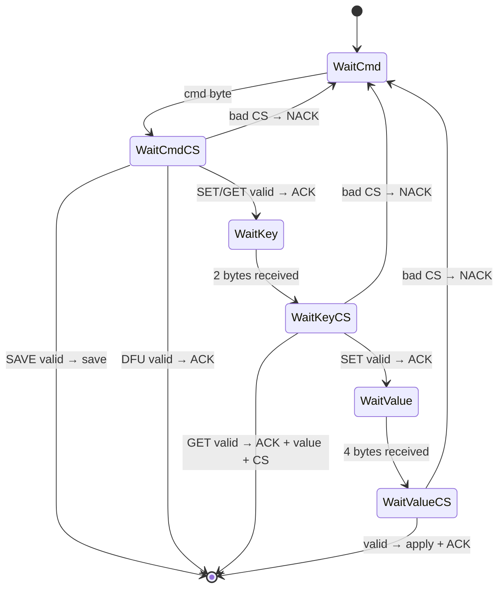

# Fade Serial Protocol (FSP)

> Inspired by AN3155. Used for reading/writing flight controller config over USB CDC at 115200 baud.

## Constants

| Name | Hex | Description |
|------|-----|-------------|
| SET | `0x67` | Write a value to a key |
| GET | `0x69` | Read a value from a key |
| DFU | `0xDF` | Enter DFU bootloader |
| SAVE | `0xFE` | Persist config to flash |
| ACK | `0x0A` | Accepted |
| NACK | `0xC4` | Rejected |

## Key Registry

| Key | ID | Type | Maps To |
|-----|---:|------|---------|
| P | 0 | f32 | `pid_roll.p` |
| I | 1 | f32 | `pid_roll.i` |
| D | 2 | f32 | `pid_roll.d` |

## Checksums

**Command**: complement → `cs = cmd ^ 0xFF` (verify: `cmd ^ cs == 0xFF`)

**Data** (key/value): XOR fold → `cs = d[0] ^ d[1] ^ ... ^ d[n-1]` (verify: `XOR(all) ^ cs == 0x00`)

---

## SET — Write a value

```
HOST                              FC
 │── CMD(0x67) + CS(0x98) ──────>│
 │<── ACK ────────────────────────│
 │── KEY(u16 BE) + CS ──────────>│
 │<── ACK ────────────────────────│
 │── VALUE(f32 BE) + CS ────────>│
 │<── ACK ────────────────────────│
```

## GET — Read a value

```
HOST                              FC
 │── CMD(0x69) + CS(0x96) ──────>│
 │<── ACK ────────────────────────│
 │── KEY(u16 BE) + CS ──────────>│
 │<── ACK + VALUE(f32 BE) + CS ──│
```

> [!IMPORTANT]
> GET value response is **6 bytes**: ACK (1) + f32 BE (4) + XOR checksum (1).
> The configurator reads ACK first (`waitForAck`), then the remaining 5 bytes (`readFull`).

## SAVE — Persist to flash

```
HOST                              FC
 │── CMD(0xFE) + CS(0x01) ──────>│
 │   (FC writes config to W25Q flash asynchronously)
```

## DFU — Enter bootloader

```
HOST                              FC
 │── CMD(0xDF) + CS(0x20) ──────>│
 │<── ACK ────────────────────────│
```

---

## State Machine



## Code References

| Side | File | Functions |
|------|------|-----------|
| Firmware | [fsp.rs](file:///Users/adam/Developer/fade/src/fsp.rs) | `Fsp::parse()` |
| Configurator | [fsp.go](file:///Users/adam/Developer/fade-configurator/device/fsp/fsp.go) | `SetValue()`, `GetValue()` |
| Test | [listener.py](file:///Users/adam/Developer/fade/listener.py) | `set_value()`, `get_value()` |
