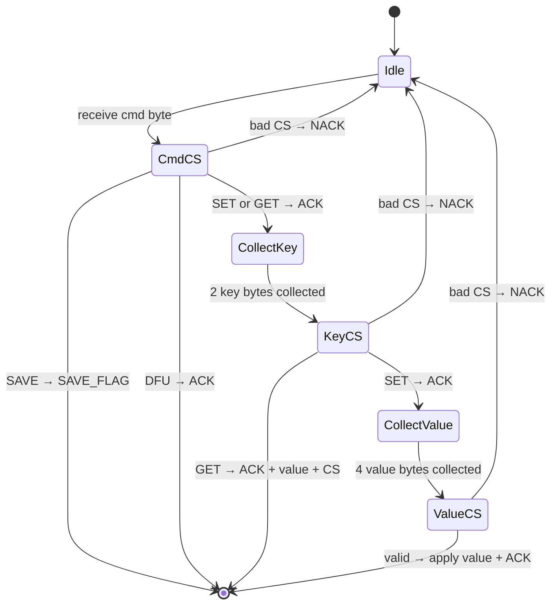

# Fade Serial Protocol (FSP)

> Inspired by AN3155. Runs over USB CDC at 115200 baud.
> Used by the [fade-configurator](https://github.com/FADAMIS/fade-configurator) to read/write flight controller config.

## Constants

| Name | Hex | Description |
|------|-----|-------------|
| SET | `0x67` | Write a value to a key |
| GET | `0x69` | Read a value by key |
| DFU | `0xDF` | Enter DFU bootloader |
| SAVE | `0xFE` | Persist config to W25Q flash |
| ACK | `0x0A` | Accepted |
| NACK | `0xC4` | Rejected |

Internal firmware constant (not sent over wire):

| Name | Hex | Description |
|------|-----|-------------|
| SAVE_FLAG | `0x53` | Returned by `parse()` to signal `fsp_task` to trigger a flash save |

## Key Registry

All values are **f32** (IEEE 754, 4 bytes big-endian).

| Key | ID (u16) | Maps To |
|-----|----------|---------|
| P | `0x0000` | `config.pid_roll.p` |
| I | `0x0001` | `config.pid_roll.i` |
| D | `0x0002` | `config.pid_roll.d` |

Unknown keys → NACK.

## Checksums

### Command checksum (complement)

```
checksum = cmd ^ 0xFF
```

Firmware verifies: `cmd ^ checksum_byte == 0xFF`

### Data checksum (XOR fold)

Used for key bytes, value bytes, and GET response.

```
checksum = d[0] ^ d[1] ^ ... ^ d[n-1]
```

Firmware verifies: `XOR(data_bytes) ^ checksum_byte == 0x00`

---

## SET — Write a value

Writes an f32 value to a key in the in-memory config. Does **not** persist to flash (use SAVE after).

```
HOST                                FC
 │                                   │
 │─── [0x67, 0x98] ────────────────>│  CMD_SET + complement
 │<── [0x0A] ───────────────────────│  ACK
 │                                   │
 │─── [key_hi, key_lo, cs] ────────>│  key (u16 BE) + XOR checksum
 │<── [0x0A] ───────────────────────│  ACK
 │                                   │
 │─── [v0, v1, v2, v3, cs] ────────>│  value (f32 BE) + XOR checksum
 │<── [0x0A] ───────────────────────│  ACK
```

**Byte counts**: host sends 2 + 3 + 5 = 10 bytes, FC replies 1 + 1 + 1 = 3 bytes.

---

## GET — Read a value

Reads an f32 value from a key.

```
HOST                                FC
 │                                   │
 │─── [0x69, 0x96] ────────────────>│  CMD_GET + complement
 │<── [0x0A] ───────────────────────│  ACK
 │                                   │
 │─── [key_hi, key_lo, cs] ────────>│  key (u16 BE) + XOR checksum
 │<── [0x0A, v0, v1, v2, v3, cs] ──│  ACK + value (f32 BE) + XOR checksum
```

**Byte counts**: host sends 2 + 3 = 5 bytes, FC replies 1 + 6 = 7 bytes.

> [!IMPORTANT]
> The GET value response is **6 bytes sent as one packet**: `[ACK, f32_b0, f32_b1, f32_b2, f32_b3, xor_cs]`.
> The configurator reads this in two calls: `waitForAck()` consumes the first byte (ACK), then `readFull(5)` reads the value + checksum.

---

## SAVE — Persist to flash

Triggers an async write of the in-memory config to the W25Q128FV external SPI flash.

```
HOST                                FC
 │                                   │
 │─── [0xFE, 0x01] ────────────────>│  CMD_SAVE + complement
 │                                   │  (FC signals w25q_save_task internally)
```

> [!NOTE]
> SAVE does **not** send an ACK back over USB. The firmware parser returns `SAVE_FLAG (0x53)` internally to `fsp_task`, which signals `w25q_save_task` via `SAVE_SIGNAL`. The actual flash write (sector erase + page program) happens asynchronously.

---

## DFU — Enter bootloader

```
HOST                                FC
 │                                   │
 │─── [0xDF, 0x20] ────────────────>│  CMD_DFU + complement
 │<── [0x0A] ───────────────────────│  ACK
```

---

## Error handling

Any invalid checksum at any stage → NACK (`0xC4`) and state machine resets to idle.

Any unknown command → NACK and reset.

Any unknown key on GET → NACK (single byte response instead of the 6-byte value response).

---

## Firmware State Machine

The parser (`Fsp::parse()`) processes **one byte at a time** and uses an `expect_checksum` flag to alternate between data collection and checksum verification.



## Firmware Integration

```
USB CDC rx ──> fsp_task ──> Fsp::parse(byte) ──> response bytes ──> USB CDC tx
                  │
                  │ if response[0] == SAVE_FLAG
                  ▼
            SAVE_SIGNAL ──> w25q_save_task ──> W25Q128FV SPI flash
```

`fsp_task` in `main.rs` reads USB packets (up to 64 bytes), feeds each byte to `Fsp::parse()`, and writes any response back over USB. The `FlightConfig` is protected by a `Mutex`.

## Code References

| Side | File | Key Functions |
|------|------|---------------|
| Firmware parser | [fsp.rs](file:///Users/adam/Developer/fade/src/fsp.rs) | `Fsp::parse()`, `make_get_response()`, `apply_value()` |
| Firmware task | [main.rs](file:///Users/adam/Developer/fade/src/main.rs) | `fsp_task()`, `w25q_save_task()` |
| Configurator | [fsp.go](file:///Users/adam/Developer/fade-configurator/device/fsp/fsp.go) | `SetValue()`, `GetValue()`, `sendCmd()`, `waitForAck()` |
| CLI tool | [write_pid.py](file:///Users/adam/Developer/fade/write_pid.py) | `set_value()`, `get_value()`, `save()` |
| Test script | [listener.py](file:///Users/adam/Developer/fade/listener.py) | `set_value()`, `get_value()`, `save()` |
